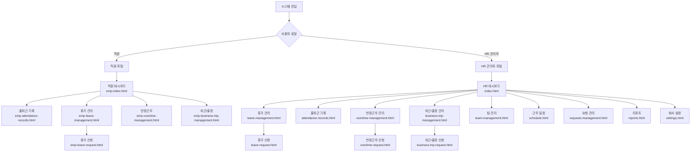

# Screen Specifications Index

> Auto-generated from prototype analysis  
> Last updated: 2026-02-09  
> Prototype Version: ver0.1/ver1

---

## Overview

This document serves as the master registry for all screen specifications in the **Suprema T&A (Time & Attendance Management System)**. Each screen has its own detailed specification document following a standardized template. These specs are the **single source of truth** for both frontend development and backend API contract generation.

---

## Screen Inventory

### System Overview

The application is divided into two primary user portals:

- **Employee Portal**: For employees to view their own records and submit requests
- **HR Admin Portal**: For HR/Managers to manage company-wide records and process requests

### Complete Screen List

| #   | Screen ID                    | Screen Name (KO) | Route                     | File                            | Portal   | Auth | Roles             |
| --- | ---------------------------- | ---------------- | ------------------------- | ------------------------------- | -------- | ---- | ----------------- |
| 1   | hr-dashboard                 | HR 대시보드      | /dashboard                | dashboard.md                    | HR       | Yes  | HR Admin, Manager |
| 2   | hr-leave-management          | 휴가 관리        | /leave-management         | leave-management.md             | HR       | Yes  | HR Admin, Manager |
| 3   | hr-leave-request             | 휴가 신청        | /leave-request            | leave-request.md                | HR       | Yes  | HR Admin, Manager |
| 4   | hr-attendance-records        | 출퇴근 기록      | /attendance-records       | attendance-records.md           | HR       | Yes  | HR Admin, Manager |
| 5   | hr-overtime-management       | 연장근무 관리    | /overtime-management      | overtime-management.md          | HR       | Yes  | HR Admin, Manager |
| 6   | hr-overtime-request          | 연장근무 신청    | /overtime-request         | overtime-request.md             | HR       | Yes  | HR Admin, Manager |
| 7   | hr-business-trip-management  | 외근/출장 관리   | /business-trip-management | business-trip-management.md     | HR       | Yes  | HR Admin, Manager |
| 8   | hr-business-trip-request     | 외근/출장 신청   | /business-trip-request    | business-trip-request.md        | HR       | Yes  | HR Admin, Manager |
| 9   | hr-team-management           | 팀 관리          | /team-management          | team-management.md              | HR       | Yes  | HR Admin, Manager |
| 10  | hr-schedule                  | 근무 일정        | /schedule                 | schedule.md                     | HR       | Yes  | HR Admin, Manager |
| 11  | hr-requests-management       | 요청 관리        | /requests-management      | requests-management.md          | HR       | Yes  | HR Admin, Manager |
| 12  | hr-reports                   | 리포트           | /reports                  | reports.md                      | HR       | Yes  | HR Admin          |
| 13  | hr-settings-general          | 회사 설정        | /settings/general         | settings-general.md             | HR       | Yes  | HR Admin          |
| 14  | hr-settings-employee         | 직원 관리 설정   | /settings/employee        | settings-employee.md            | HR       | Yes  | HR Admin          |
| 15  | emp-dashboard                | 직원 대시보드    | /emp/dashboard            | emp-dashboard.md                | Employee | Yes  | Employee          |
| 16  | emp-attendance-records       | 직원 출퇴근 기록 | /emp/attendance           | emp-attendance-records.md       | Employee | Yes  | Employee          |
| 17  | emp-leave-management         | 직원 휴가 관리   | /emp/leave                | emp-leave-management.md         | Employee | Yes  | Employee          |
| 18  | emp-leave-request            | 직원 휴가 신청   | /emp/leave/request        | emp-leave-request.md            | Employee | Yes  | Employee          |
| 19  | emp-overtime-management      | 직원 연장근무    | /emp/overtime             | emp-overtime-management.md      | Employee | Yes  | Employee          |
| 20  | emp-business-trip-management | 직원 외근/출장   | /emp/business-trip        | emp-business-trip-management.md | Employee | Yes  | Employee          |

---

## Documentation Status

| Portal    | Total Screens | Complete  | In Progress | Not Started |
| --------- | ------------- | --------- | ----------- | ----------- |
| Employee  | 6             | 6 ✅      | -           | -           |
| HR Admin  | 14            | 11 ✅     | -           | 3 📋        |
| **TOTAL** | **20**        | **17 ✅** | **-**       | **3 📋**    |

### Detailed Completion Status

#### Employee Portal (6/6) ✅ Complete

- ✅ emp-dashboard.md - Employee Dashboard
- ✅ emp-attendance-records.md - Employee Attendance Records
- ✅ emp-leave-management.md - Employee Leave Management
- ✅ emp-leave-request.md - Employee Leave Request Form
- ✅ emp-overtime-management.md - Employee Overtime Management
- ✅ emp-business-trip-management.md - Employee Business Trip Management

#### HR Admin Portal (14 Total)

**Complete (11/11)** ✅:

- ✅ hr-dashboard.md - HR Dashboard
- ✅ hr-attendance-records.md - HR Attendance Records
- ✅ hr-leave-management.md - HR Leave Management (Approval Queue)
- ✅ hr-leave-request.md - HR Leave Request Form
- ✅ hr-overtime-management.md - HR Overtime Management (Approval Queue)
- ✅ hr-overtime-request.md - HR Overtime Request Form
- ✅ hr-business-trip-management.md - HR Business Trip Management (Approval Queue)
- ✅ hr-business-trip-request.md - HR Business Trip Request Form
- ✅ hr-team-management.md - HR Team Management
- ✅ hr-schedule.md - HR Schedule Management
- ✅ hr-requests-management.md - HR Requests Management (Unified Approval Queue)

**Not Yet Implemented (Deferred)** 📋:

- ⏳ hr-reports.md - HR Reports & Analytics (Advanced)
- ⏳ hr-settings-general.md - Company Settings (Configuration)
- ⏳ hr-settings-employee.md - Settings (Employee Policies)

---

## Screen Relationship Map



---

## Shared Components & Patterns

### Common Components Referenced Across Screens

| Component                           | Type         | Used In                     | Purpose                                                            |
| ----------------------------------- | ------------ | --------------------------- | ------------------------------------------------------------------ |
| **Sidebar Navigation**              | Layout       | All HR screens              | Main navigation menu with collapsible state                        |
| **Header**                          | Layout       | All HR screens              | Top bar with user mode selector (Employee/HR Admin), notifications |
| **Date Range Picker**               | Input        | Most management screens     | Select custom date range (YYYY.MM.DD format)                       |
| **Quick Filters**                   | Button Group | Leave, Overtime, Attendance | Today, This Week, This Month quick access                          |
| **Advanced Filters (Notion-style)** | Filter UI    | Leave-mgmt, Overtime-mgmt   | Multi-criteria filtering with chips                                |
| **Status Badge**                    | Component    | All data tables             | Color-coded status display (Pending/Approved/Rejected)             |
| **Leave Type Badge**                | Component    | Leave-related screens       | Color-coded leave group badges                                     |
| **Data Table**                      | Component    | All management screens      | Paginated, sortable, multi-select table                            |
| **Pagination**                      | Navigation   | All tables                  | Previous/Next page + item count                                    |
| **Action Icons**                    | Component    | Data tables                 | Approve/Reject/View buttons per row                                |
| **Modal/Dialog**                    | Overlay      | Rejection, Details          | Confirmation and detailed information dialogs                      |
| **Toast Notification**              | Feedback     | All screens with actions    | Success/Error/Info notifications                                   |
| **Empty State**                     | Display      | All data tables             | Message when no data matches filters                               |
| **Loading Skeleton**                | Loading      | All data tables             | Shimmer effect while loading data                                  |

### Color Coding System

#### Leave Group Colors

- **연차 (Annual)**: Blue badge - `bg-blue-100`, text: `text-blue-900`
- **병가 (Sick)**: Amber badge - `bg-amber-100`, text: `text-amber-900`
- **경조 (Family Event)**: Rose badge - `bg-rose-100`, text: `text-rose-900`
- **산전후 (Maternity)**: Purple badge - `bg-purple-100`, text: `text-purple-900`
- **무급 (Unpaid)**: Slate badge - `bg-slate-100`, text: `text-slate-600`
- **공가 (Official)**: Green badge - `bg-green-100`, text: `text-green-900`

#### Status Colors

- **대기 (Pending)**: Amber - `bg-amber-100`, text: `text-amber-900`
- **승인 (Approved)**: Green - `bg-emerald-100`, text: `text-emerald-900`
- **반려 (Rejected)**: Red - `bg-red-100`, text: `text-red-900`
- **완료 (Completed)**: Slate - `bg-slate-100`, text: `text-slate-600`

### Standard Patterns

#### Pagination

- **Default items per page**: 15
- **Page size options**: [15, 30, 50]
- **Info text**: `총 {total}건 중 {start}-{end}건`
- **Max visible pages**: 5

#### Date Formats

- **UI Display**: YYYY.MM.DD (e.g., 2026.01.27)
- **API/Backend**: YYYY-MM-DD ISO 8601 (e.g., 2026-01-27)

#### Filter Logic

- **Multiple filters**: AND logic (all conditions must match)
- **Multiple values within same filter**: OR logic (any value can match)
- **Filter persistence**: Via URL parameters

#### API Response Structure

```typescript
interface ListResponse<T> {
  data: T[];
  meta: {
    total: number;
    page: number;
    pageSize: number;
    totalPages: number;
  };
  summary?: Record<string, number>; // For summary cards
}
```

---

## Portal-Specific Features

### HR Admin Portal Features

- **Management**: View, approve, reject leave/overtime/business trip requests from all employees
- **Bulk Actions**: Batch approve/reject with multi-select
- **Reporting**: Generate reports across company data
- **Settings**: Configure company rules, leave types, policies
- **Team Management**: Manage organizational structure
- **Schedule Management**: View and manage work schedules

### Employee Portal Features

- **View**: Check personal records (attendance, leave balance)
- **Request**: Submit leave/overtime/business trip requests
- **History**: View past requests and their status
- **Balance**: Check remaining leave/benefits
- **Corrections**: Request corrections for attendance records

---

## Key Flows & User Journeys

### Leave Request Flow

```
Employee Views Leave Balance
  ↓
Employee Submits Leave Request
  ↓
HR Admin Reviews in Leave Management
  ↓
HR Admin Approves/Rejects Request
  ↓
Employee Sees Updated Status
  ↓
System Updates Leave Balance
```

### Data Lifecycle

- **Creation**: Employee submits request (Status: PENDING)
- **Review**: HR Admin reviews (Status: PENDING)
- **Action**: HR Admin approves or rejects (Status: APPROVED or REJECTED)
- **Enforcement**: System enforces approved status for payroll/reporting

---

## Technical Specifications

### Technology Stack (From Prototype)

- **Frontend**: React 18 with JSX (via Babel)
- **Styling**: Tailwind CSS
- **Data**: Sample data generated in-memory; ready for API integration
- **Excel Export**: XLSX library for report downloads
- **Icons**: SVG-based custom icon set

### Layout Architecture

```
┌─ Sidebar (fixed, collapsible) ────────────┐
│                                           │
│  ┌─ Header (fixed) ──────────────────┐   │
│  │                                   │   │
│  ├─ Content Area ───────────────────┬┘   │
│  │ (scrollable, responsive)         │    │
│  │                                  │    │
│  │ (Summary Cards if applicable)   │    │
│  │ (Filter Bar if applicable)      │    │
│  │ (Data Table)                    │    │
│  │ (Pagination)                    │    │
│  │                                  │    │
│  └──────────────────────────────────┘    │
│                                           │
└───────────────────────────────────────────┘
```

### Breakpoints

- **Desktop**: ≥1280px (full layout)
- **Tablet**: 768-1279px (adjusted cards/table)
- **Mobile**: <768px (stacked layout, card view for tables)

---

## Specification File Structure

Each screen spec document follows this structure:

```
1. Screen Overview
   - Purpose
   - Access Control (by role)
   - Entry/Exit Points

2. Screen Layout
   - Full wireframe
   - Zone descriptions

3. Components (Header, Cards, Filters, Table, Modals)
   - Visual specifications
   - Behavioral specifications

4. Data Model
   - TypeScript interfaces
   - Enums
   - Sample data structure

5. API Requirements
   - List of API calls needed
   - Request/response shapes

6. State Diagram & Edge Cases
   - Possible states
   - Error handling
   - Race conditions

7. Accessibility & Keyboard Shortcuts
```

---

## Documentation Status

| Screen ID                    | Status   | Completed | Last Updated |
| ---------------------------- | -------- | --------- | ------------ |
| hr-dashboard                 | Pending  | —         | —            |
| hr-leave-management          | Complete | ✅        | 2026-02-09   |
| hr-leave-request             | Pending  | —         | —            |
| hr-attendance-records        | Pending  | —         | —            |
| hr-overtime-management       | Pending  | —         | —            |
| hr-overtime-request          | Pending  | —         | —            |
| hr-business-trip-management  | Pending  | —         | —            |
| hr-business-trip-request     | Pending  | —         | —            |
| hr-team-management           | Pending  | —         | —            |
| hr-schedule                  | Pending  | —         | —            |
| hr-requests-management       | Pending  | —         | —            |
| hr-reports                   | Pending  | —         | —            |
| hr-settings-general          | Pending  | —         | —            |
| hr-settings-employee         | Pending  | —         | —            |
| emp-dashboard                | Pending  | —         | —            |
| emp-attendance-records       | Pending  | —         | —            |
| emp-leave-management         | Pending  | —         | —            |
| emp-leave-request            | Pending  | —         | —            |
| emp-overtime-management      | Pending  | —         | —            |
| emp-business-trip-management | Pending  | —         | —            |

---

## How to Use This Index

1. **For Frontend Developers**: Use individual screen spec documents to implement exact UI layouts and component behaviors
2. **For Backend Developers**: Use API Requirements sections to define API contracts and response shapes
3. **For Designers**: Use wireframes and component specs for design validation
4. **For QA**: Use edge cases and state diagrams for test coverage planning

---

## Next Steps

1. ✅ Create this INDEX.md
2. ⏳ Generate individual screen specifications (20 screens total)
3. ⏳ Validate specs against prototype HTML
4. ⏳ Update documentation status as specs are completed
5. ⏳ Create shared-components.md for reusable component specs

---

**Document Version**: 0.1  
**Last Updated**: 2026-02-09  
**Maintained By**: Product Design Team
