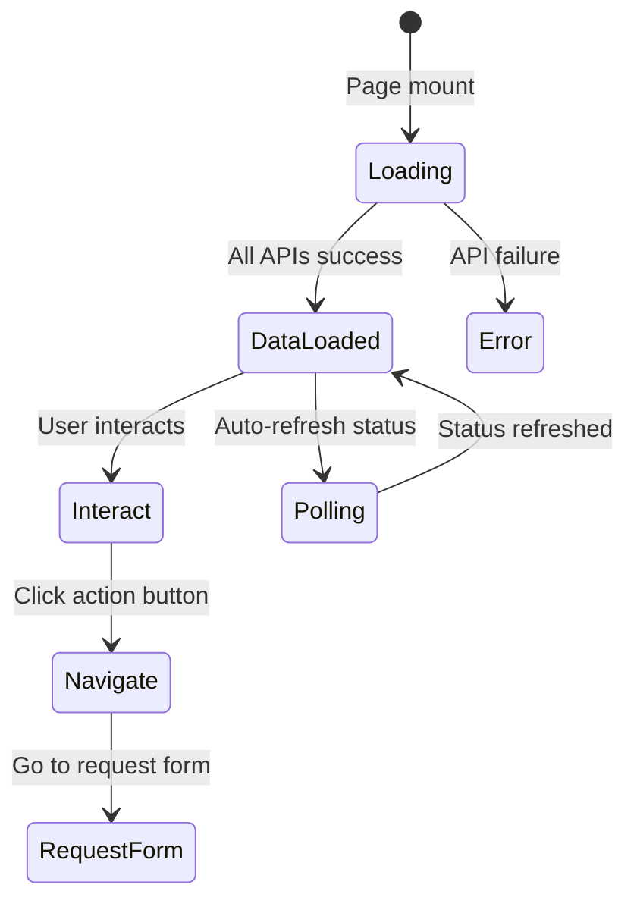

# 직원 대시보드 화면 명세

> Document Version: 0.2  
> Last Updated: 2026-02-09  
> Screen ID: `emp-dashboard`  
> Route: `/emp/dashboard`  
> Parent Layout: `Employee Portal Layout`  
> Prototype File: `emp-index.html`

---

## 1. Screen Overview

### 1.1 Purpose

- **Primary Goal**: Employees access their personalized dashboard showing today's attendance status, quick stats, recent requests, and fast access to key functions
- **Core Functions**:
  - Display current check-in/check-out status
  - Show today's time tracking (in/out times)
  - View quick summary cards (Annual leave, Today's Schedule)
  - See recent leave/overtime/business trip requests with status
  - Quick navigation to submit new requests
  - View company announcements and notifications
  - Access user profile and settings

### 1.2 Access Control

| Role     | Access        | Scope         | Notes                                  |
| -------- | ------------- | ------------- | -------------------------------------- |
| Employee | Full          | Own data only | Default landing page after login       |
| Manager  | Cannot access | —             | Different dashboard from HR view       |
| HR Admin | Cannot access | —             | Different dashboard from Employee view |

### 1.3 Entry Points

- **Primary**: Application entry point (default after login)
- **Sidebar**: Sidebar navigation → "대시보드" (Home icon)
- **URL Direct**: `/emp/dashboard` (requires employee auth)
- **From other screens**: Click "Suprema T&A" logo in header

### 1.4 Exit Points

- **Sidebar**: Navigate to any other menu item (Leave, Attendance, Overtime, etc.)
- **Request Buttons**: Quick action buttons navigate to request forms
- **Header Mode Switch**: Click "HR 관리자" to access HR admin portal

---

## 2. Screen Layout

### 2.1 Full Layout Wireframe

```
┌─────────────────────────────────────────────────────────────────────────────────┐
│ Sidebar │ Logo                        [직원 tab] [HR 관리자]                 🔔 │
├─────────────────────────────────────────────────────────────────────────────────┤
│                                                                                 │
│  안녕하세요, {직원명}님!                                                          │
│                                                                                 │
│  ┌──────────────────────────────────────────────────────────────────────────┐  │
│  │  오늘 (2026.02.09)                                                       │  │
│  │                                                                          │  │
│  │  ┌─────────────────┐  ┌─────────────────┐  ┌─────────────────┐          │  │
│  │  │ 출근: 09:00    │  │ 퇴근: 18:00    │  │ 근무시간: 8h   │          │  │
│  │  └─────────────────┘  └─────────────────┘  └─────────────────┘          │  │
│  │                                                                          │  │
│  │  [출근 인정 요청] [퇴근 시간 수정] [근태 정정]                            │  │
│  └──────────────────────────────────────────────────────────────────────────┘  │
│                                                                                 │
│  ┌──────────────┐  ┌──────────────┐  ┌──────────────┐                         │
│  │ 연차: 7일   │  │ 오늘 일정    │  │ 미승인 요청  │                         │
│  │ {stat}      │  │ (office)     │  │ {count}건    │                         │
│  └──────────────┘  └──────────────┘  └──────────────┘                         │
│                                                                                 │
│  [+ 휴가 신청] [+ 연장근무 신청] [+ 외근/출장 신청]                              │
│                                                                                 │
│  ┌──────────────────────────────────────────────────────────────────────────┐  │
│  │ 최근 신청 현황 (4건)                                                     │  │
│  │                                                                          │  │
│  │ [연차 신청] 2026-02-03 (1일)              [대기중]                       │  │
│  │ [연장근무] 2026-02-02 (2h)                [승인]                         │  │
│  │ [외근/출장] 2026-02-01 (서울)            [대기중]                        │  │
│  │ [연차 신청] 2026-01-28 (1일)              [승인]                         │  │
│  └──────────────────────────────────────────────────────────────────────────┘  │
│                                                                                 │
│  ┌──────────────────────────────────────────────────────────────────────────┐  │
│  │ 공지사항                                               [더보기] →          │  │
│  │                                                                          │  │
│  │ [공지] 2월 회사 일정 및 휴무 안내 (2026-02-09)                           │  │
│  │ [공지] 새로운 근태 시스템 업데이트 안내 (2026-02-05)                     │  │
│  │ [공지] 2026년 정기 휴가 관리 지침 (2026-01-30)                           │  │
│  └──────────────────────────────────────────────────────────────────────────┘  │
│                                                                                 │
└─────────────────────────────────────────────────────────────────────────────────┘
```

### 2.2 Layout Zones

| Zone             | Position      | Description                        | Width                                     |
| ---------------- | ------------- | ---------------------------------- | ----------------------------------------- |
| Sidebar          | Left          | Navigation menu                    | Fixed 64px (collapsed) / 256px (expanded) |
| Header           | Top           | Logo, mode selector, notifications | Full minus sidebar                        |
| Page Title       | Below header  | Greeting + date                    | Full content area                         |
| Today's Status   | Below title   | Current check-in/out info          | Full width                                |
| Quick Stats Grid | Below status  | 3 stat cards                       | 3 columns (responsive)                    |
| Quick Actions    | Below stats   | 3 primary action buttons           | Full width                                |
| Recent Requests  | Below actions | List of recent requests            | Full width                                |
| Announcements    | Bottom        | Company announcements              | Full width                                |

---

## 3. Header Section

### 3.1 Title/Greeting

- **Text**: "안녕하세요, {직원명}님!"
- **Typography**: `text-2xl font-bold mb-2`
- **Dynamic Content**: Employee name injected from user profile

---

## 4. Today's Status Card

### 4.1 Card Header

- **Title**: `오늘 ({formattedDate})`
- **Format**: 오늘 (YYYY.MM.DD)
- **Typography**: `text-lg font-semibold text-slate-800`

### 4.2 Status Display

Three stat boxes in a row:

```
┌─────────────────┐  ┌─────────────────┐  ┌─────────────────┐
│ 출근: 09:00     │  │ 퇴근: 18:00     │  │ 근무시간: 8h    │
│ (Checked in)    │  │ (Not checked out)│  │ (Work hours)    │
└─────────────────┘  └─────────────────┘  └─────────────────┘
```

**Box Styling**:

- **Width**: `1/3 - gap` per box
- **Background**: `bg-white`
- **Border**: `border border-slate-100`
- **Padding**: `p-4`
- **Border Radius**: `rounded-xl`
- **Label Color**: `text-sm text-slate-500`
- **Value Color**: `text-2xl font-bold text-slate-800`

### 4.3 Possible States

| Status Box       | Checked In  | Checked Out | Value Display         |
| ---------------- | ----------- | ----------- | --------------------- |
| 출근 (Check-in)  | ✓ Green     | —           | 09:00                 |
| 퇴근 (Check-out) | —           | ✓ Green     | 18:00                 |
| 퇴근 (Check-out) | ✓ (waiting) | —           | 대기 중 (Pending)     |
| 근무시간         | ✓           | ✓           | 8h (calculated)       |
| 근무시간         | ✓           | —           | 계산 중 (Calculating) |

### 4.4 Action Buttons (Below Status)

| #   | Button         | Action                                 | Condition      |
| --- | -------------- | -------------------------------------- | -------------- |
| 1   | 출근 인정 요청 | Navigate to attendance correction form | Always visible |
| 2   | 퇴근 시간 수정 | Navigate to edit check-out time        | Always visible |
| 3   | 근태 정정      | Navigate to attendance correction form | Always visible |

**Button Styling**:

- **Layout**: Flex with gap
- **Font**: `text-sm font-medium`
- **Color**: `text-primary-600 hover:text-primary-700`
- **Border**: `border border-primary-200 rounded-lg px-4 py-2`

---

## 5. Quick Stats Cards (Grid)

Three cards in a 3-column grid:

### 5.1 Card 1: Annual Leave Status

```
┌──────────────────┐
│ 연차: 7일         │
│ 8/15일 사용      │
│ (progress bar)   │
└──────────────────┘
```

- **Label**: "연차: 7일"
- **Sub-label**: "8/15일 사용"
- **Progress Bar**: Visual indicator
- **Color**: Blue (primary)
- **Action**: (No direct action; informational)

### 5.2 Card 2: Today's Schedule

```
┌──────────────────┐
│ 오늘 일정        │
│ office           │
│ 09:00 - 18:00   │
└──────────────────┘
```

- **Label**: "오늘 일정"
- **Location**: office / wfh / business-trip
- **Time**: Working hours
- **Color**: Amber (work)

### 5.3 Card 3: Pending Requests

```
┌──────────────────┐
│ 미승인 요청      │
│ {count}건       │
│ 확인하기 →      │
└──────────────────┘
```

- **Label**: "미승인 요청"
- **Count**: Number of pending requests
- **Link**: "확인하기 →" navigates to recent requests section
- **Color**: Red/Warning (attention needed)

**Card Styling**:

- **Width**: `1/3 - gap`
- **Height**: Auto
- **Background**: `bg-white`
- **Border**: `border border-slate-100`
- **Padding**: `p-5`
- **Border Radius**: `rounded-xl`
- **Hover**: `hover:shadow-lg transition-shadow`
- **Typography**: Label `text-sm text-slate-500`, Value `text-2xl font-bold text-slate-800`

---

## 6. Quick Action Buttons (Primary Actions)

Three large buttons in a row:

| Button           | Icon      | Action                  | Route                        |
| ---------------- | --------- | ----------------------- | ---------------------------- |
| + 휴가 신청      | Plus      | Submit leave request    | `/emp/leave/request`         |
| + 연장근무 신청  | Timer     | Submit overtime request | `/emp/overtime/request`      |
| + 외근/출장 신청 | Briefcase | Submit business trip    | `/emp/business-trip/request` |

**Button Styling**:

- **Layout**: Flex with gap
- **Width**: 1/3 each
- **Background**: `bg-primary-600 hover:bg-primary-700`
- **Text Color**: `text-white`
- **Padding**: `px-6 py-3`
- **Border Radius**: `rounded-xl`
- **Font**: `font-medium`
- **Icon**: Plus icon before label
- **Shadow**: `shadow-sm`

---

## 7. Recent Requests Card

### 7.1 Card Header

- **Title**: "최근 신청 현황"
- **Count**: `({count}건)`
- **Typography**: Title `text-lg font-semibold`, Count `text-sm text-slate-500`

### 7.2 Request Items

List of recent requests (4 items typically shown):

```
┌─────────────────────────────────────────────────┐
│ [연차 신청] 2026-02-03 (1일)      [대기중]      │
│ [연장근무] 2026-02-02 (2h)        [승인]        │
│ [외근/출장] 2026-02-01 (서울)    [대기중]      │
│ [연차 신청] 2026-01-28 (1일)      [승인]        │
└─────────────────────────────────────────────────┘
```

**Item Layout**:

- **Left**: Request type badge + date + details
- **Right**: Status badge
- **Spacing**: `space-y-2`
- **Padding**: `p-3`
- **Hover**: `hover:bg-slate-50 transition-colors`

**Request Type Badge**:

- **Styling**: `text-xs font-semibold px-2 py-1 rounded-lg`
- **Colors**:
  - Leave: Blue
  - Overtime: Amber
  - Business Trip: Green

**Status Badge**:

- **Pending**: Amber `bg-amber-100 text-amber-700`
- **Approved**: Green `bg-green-100 text-green-700`
- **Rejected**: Red `bg-red-100 text-red-700`

---

## 8. Announcements Card

### 8.1 Card Header

- **Title**: "공지사항"
- **View More**: "더보기 →" (link to announcements page)
- **Typography**: Title `text-lg font-semibold`, Link `text-sm text-primary-600`

### 8.2 Announcement Items

List of recent announcements (3 items typically shown):

```
[공지] 2월 회사 일정 및 휴무 안내 (2026-02-09)
[공지] 새로운 근태 시스템 업데이트 안내 (2026-02-05)
[공지] 2026년 정기 휴가 관리 지침 (2026-01-30)
```

**Item Layout**:

- **Tag**: [공지] or [긴급공지]
- **Title**: Announcement title
- **Date**: Posted date (YYYY-MM-DD)
- **Styling**: `flex items-center justify-between p-3 hover:bg-slate-50`
- **Font**: `text-sm text-slate-600`
- **Date**: `text-xs text-slate-400`

---

## 9. Responsive Behavior

### 9.1 Breakpoints

| Breakpoint | Width      | Changes                       |
| ---------- | ---------- | ----------------------------- |
| Desktop    | ≥1280px    | Full layout as wireframed     |
| Tablet     | 768-1279px | Cards stack 2+1, buttons wrap |
| Mobile     | <768px     | All sections stack vertically |

### 9.2 Responsive Rules

**Status Boxes**:

- Desktop: `grid-cols-3`
- Tablet: `grid-cols-2` with one wrapping
- Mobile: `grid-cols-1`

**Stat Cards**:

- Desktop: `grid-cols-3`
- Tablet: `grid-cols-2`
- Mobile: `grid-cols-1`

**Action Buttons**:

- Desktop: `flex gap-3` (3 cols)
- Tablet: `flex gap-3` (3 cols, may wrap)
- Mobile: `flex flex-col` (full width stack)

---

## 10. Data Model

### 10.1 Today's Status

```typescript
interface TodayStatus {
  date: string; // YYYY-MM-DD
  checkInTime?: string; // HH:MM (24-hour)
  checkOutTime?: string; // HH:MM
  workHours?: number; // Calculated hours
  workStatus: "in" | "out" | "completed" | "not_started";
}
```

### 10.2 Quick Stats

```typescript
interface QuickStats {
  remainingAnnualLeave: number; // Days remaining
  totalAnnualLeave: number; // Total allocation
  usedAnnualLeave: number; // Days used
  todaySchedule: string; // 'office' | 'wfh' | 'business-trip'
  todayWorkHours: string; // "09:00 - 18:00"
  pendingRequestsCount: number; // Number of pending approvals
}
```

### 10.3 Recent Request

```typescript
interface RecentRequest {
  id: number;
  type: "leave" | "overtime" | "business-trip";
  title: string; // Display title
  date: string; // Request date (YYYY-MM-DD)
  details: string; // e.g., "(1일)", "(2h)", "(서울)"
  status: "pending" | "approved" | "rejected";
}
```

### 10.4 Announcement

```typescript
interface Announcement {
  id: number;
  type: "notice" | "urgent";
  title: string;
  postedDate: string; // YYYY-MM-DD
  priority?: number;
}
```

---

## 11. API Requirements

### 11.1 API Calls

| #   | Method | Endpoint                                    | Purpose                         | Response                                      |
| --- | ------ | ------------------------------------------- | ------------------------------- | --------------------------------------------- |
| 1   | GET    | `/api/v1/employees/{empId}/today-status`    | Fetch today's attendance status | `{ checkInTime?, checkOutTime?, workHours? }` |
| 2   | GET    | `/api/v1/employees/{empId}/quick-stats`     | Fetch dashboard quick stats     | `{ remainingLeave, schedule, pendingCount }`  |
| 3   | GET    | `/api/v1/employees/{empId}/recent-requests` | Fetch recent requests           | `{ data: RecentRequest[] }`                   |
| 4   | GET    | `/api/v1/announcements`                     | Fetch recent announcements      | `{ data: Announcement[] }`                    |

---

## 12. State Diagram



---

## 13. Edge Cases & Special Behaviors

| #   | Scenario                    | Behavior                                          |
| --- | --------------------------- | ------------------------------------------------- |
| 1   | User not checked in         | Show check-in prompt, hide check-out time         |
| 2   | User already checked out    | Show completion badge, lock time editing          |
| 3   | No pending requests         | Hide pending count or show "0건"                  |
| 4   | No recent requests          | Show "신청 내역이 없습니다." message              |
| 5   | No announcements            | Show "공지사항이 없습니다." message               |
| 6   | Status updates in real-time | Refresh on page focus via WebSocket               |
| 7   | Request status changes      | Update UI without full page reload                |
| 8   | Mobile user on small screen | Stack all sections vertically, buttons full width |

---

## Implementation Checklist

- [ ] Sidebar + Header with logo
- [ ] Greeting with employee name
- [ ] Today's status display (check-in/out times)
- [ ] Work hours calculation
- [ ] Action buttons (correction requests)
- [ ] Quick stats cards (3 cards grid)
- [ ] Quick action buttons (3 primary actions)
- [ ] Recent requests list
- [ ] Announcements section
- [ ] Responsive grid layouts
- [ ] Status badge styling
- [ ] API integration
- [ ] Real-time updates (optional)
- [ ] Loading states
- [ ] Error handling
- [ ] Accessibility (ARIA labels)

---

**Document Version**: 0.2  
**Last Updated**: 2026-02-09  
**Status**: Specification Complete - Ready for Frontend Development
