# 직원 휴가 관리 화면 명세

> Document Version: 0.2  
> Last Updated: 2026-02-09  
> Screen ID: `emp-leave-management`  
> Route: `/emp/leave`  
> Parent Layout: `Employee Portal Layout`  
> Prototype File: `emp-leave-management.html`

---

## 1. Screen Overview

### 1.1 Purpose

- **Primary Goal**: Employees view their leave balance, submit leave requests, and track leave request status
- **Core Functions**:
  - View remaining leave balance by type (Annual, Sick, Family Event, etc.)
  - See leave request status (Pending, Approved, Rejected)
  - View historical leave usage by month
  - Quick access to submit new leave requests
  - View leave request details and approver information

### 1.2 Access Control

| Role         | Access        | Scope               | Notes                                          |
| ------------ | ------------- | ------------------- | ---------------------------------------------- |
| Employee     | Full          | Own data only       | Can view own leave records and submit requests |
| Manager      | Cannot access | —                   | Should not see employee portal                 |
| HR Admin     | Cannot access | —                   | Should not see employee portal                 |
| System Admin | Can access    | All (for debugging) | Impersonation capability                       |

### 1.3 Entry Points

- **Primary**: Sidebar navigation menu → "휴가관리" (Island/Plane icon)
- **From Dashboard**: Leave management card or quick action link
- **URL Direct**: `/emp/leave` (requires employee auth)
- **From Header Mode Selector**: Employee is already in employee portal (no mode switch needed)

### 1.4 Exit Points

- **Sidebar**: Navigate to any other menu item (Dashboard, Attendance, Overtime, etc.)
- **Header Mode Switch**: Click "HR 관리자" to open HR admin portal (new tab/redirect)
- **Leave Request Button**: Click "+ 휴가 신청" to go to leave request form page
- **Browser Back**: Navigate to previous page in browser history

---

## 2. Screen Layout

### 2.1 Full Layout Wireframe

```
┌─────────────────────────────────────────────────────────────────────────────────┐
│ Sidebar (w-64) │ Suprema T&A          [직원 tab] [HR 관리자]           🔔 (2) │
├─────────────────────────────────────────────────────────────────────────────────┤
│                                                                                 │
│  휴가관리                                                                        │
│  휴가 현황 및 신청 내역을 관리합니다                                             │
│                                                                                 │
│  [+ 휴가 신청]                                                                  │
│                                                                                 │
│  ┌──────────────────────────────────────────────────────────────────────────┐  │
│  │ 휴가 현황                                      Left: 3 col, Right: 2 col │  │
│  │                                                                          │  │
│  │ ┌─────────────────────────┐  ┌─────────────────────────────────────┐   │  │
│  │ │ 잔여 연차: 7일           │  │ 휴가 신청 현황          (1건 대기중)  │   │  │
│  │ │ ==================       │  │ ┌───────────────────────────────────┐  │  │
│  │ │                          │  │ │ 연차 (1일) [승인 대기]             │  │  │
│  │ │ 연차휴가: 8/15일        │  │ │ 📅 2026-02-03                     │  │  │
│  │ │ ━━━━━━━━━━━━━━━━━       │  │ │ 신청: 2026-01-25  결재자: 박팀장   │  │  │
│  │ │ 병가:  0/3일           │  │ │                                   │  │  │
│  │ │ ────────────            │  │ │ 반차 (0.5일) [승인 완료]           │  │  │
│  │ │ 경조휴가: 2/5일         │  │ │ 📅 2026-01-28                     │  │  │
│  │ │ ━━━━━━━━━━━━━━━━━       │  │ │ 승인: 2026-01-21  결재자: 박팀장   │  │  │
│  │ │                          │  │ └───────────────────────────────────┘  │  │
│  │ └─────────────────────────┘  │                                         │  │
│  │                              │ 휴가 사용 이력                            │  │
│  │                              │ [이번주] [이번달] [올해] [직접선택]      │  │
│  │                              │ ┌───────────────────────────────────┐  │  │
│  │                              │ │ ─── 2026년 1월 ───               │  │  │
│  │                              │ │ 📅 연차 (2026-01-15 ~ 01-16)  2일│  │  │
│  │                              │ │ 📅 반차 (2026-01-28)          0.5일│  │  │
│  │                              │ │ ─── 2025년 12월 ───               │  │  │
│  │                              │ │ 📅 반차 (2025-12-28)          0.5일│  │  │
│  │                              │ │ 📅 경조휴가 (2025-12-10)        1일│  │  │
│  │                              │ └───────────────────────────────────┘  │  │
│  │                              │ [이전] [다음]                          │  │
│  └──────────────────────────────────────────────────────────────────────────┘  │
│                                                                                 │
└─────────────────────────────────────────────────────────────────────────────────┘
```

### 2.2 Layout Zones

| Zone          | Position     | Description                         | Sticky/Fixed | Layout                                         |
| ------------- | ------------ | ----------------------------------- | ------------ | ---------------------------------------------- |
| Sidebar       | Left         | Navigation menu, collapsible        | Fixed        | w-64 (expanded) / w-20 (collapsed)             |
| Header        | Top          | Title, mode selector, notifications | Fixed        | Full minus sidebar                             |
| Page Title    | Below header | Screen title + description          | No           | Full content area                              |
| Action Button | Below title  | "+ 휴가 신청" primary button        | No           | Left-aligned                                   |
| Content Grid  | Main         | 3-column layout (1 left, 2 right)   | No           | Responsive (1 col mobile, 2 tablet, 3 desktop) |
| Left Column   | Left         | Leave balance card                  | Scrollable   | 1/3 width on desktop                           |
| Right Column  | Right        | Request status + history            | Scrollable   | 2/3 width on desktop                           |

---

## 3. Header Section

### 3.1 Title

- **Text**: "휴가관리"
- **Subtitle**: "휴가 현황 및 신청 내역을 관리합니다"
- **Typography**:
  - Title: `text-2xl font-bold text-slate-800`
  - Subtitle: `text-slate-500`

### 3.2 Action Buttons

| #   | Button Label | Icon   | Variant      | Position    | Condition      | Action                                     |
| --- | ------------ | ------ | ------------ | ----------- | -------------- | ------------------------------------------ |
| 1   | 휴가 신청    | + Plus | Primary/Blue | Below title | Always visible | Navigate to `/emp/leave/request` form page |

**Button Specification**:

- **Color**: `bg-primary-600` hover `bg-primary-700`
- **Text Color**: `text-white`
- **Icon**: Plus icon
- **Shadow**: `shadow-lg shadow-primary-500/30`
- **Position**: Left-aligned below title
- **Size**: `px-6 py-3`
- **Border Radius**: `rounded-xl`
- **Font**: `font-medium`

---

## 4. Leave Balance Card (Left Column)

### 4.1 Card Header

- **Title**: "휴가 현황"
- **Typography**: `text-lg font-semibold text-slate-800`
- **Position**: Top of card

### 4.2 Remaining Leave Highlight

```
┌────────────────────────────┐
│ 잔여 연차: 7일              │
└────────────────────────────┘
  bg-slate-50, rounded-xl, p-4
```

- **Label**: "잔여 연차"
- **Typography**: `text-sm text-slate-500`
- **Value**: "7일"
- **Typography**: `text-3xl font-bold text-slate-800`
- **Styling**: `bg-slate-50 rounded-xl p-4`

### 4.3 Leave Details Section

**Layout**: Vertical stacked list of leave types

For each leave type:

```
연차휴가        8/15일
━━━━━━━━━━━━━━━━  (progress bar 53% filled)

병가           0/3일
────────────────  (progress bar 0% filled)

경조휴가        2/5일
━━━━━━━━━━━━━━━━  (progress bar 40% filled)
```

**Column Specification**:

| Property            | Value                                                    |
| ------------------- | -------------------------------------------------------- |
| Label               | Leave type name (e.g., "연차휴가")                       |
| Label Color         | `text-sm text-slate-600`                                 |
| Usage Display       | `{used}/{total}일` (e.g., "8/15일")                      |
| Usage Font          | `text-sm font-medium text-slate-800`                     |
| Progress Bar Height | `h-2`                                                    |
| Progress Bar BG     | `bg-slate-100 rounded-full`                              |
| Progress Fill Color | Color-coded by type (primary-500, green-500, purple-500) |
| Progress Fill Width | `width: {(used/total) * 100}%`                           |
| Spacing             | `space-y-3` between items                                |

---

## 5. Leave Request Status Card (Right Column, Top)

### 5.1 Card Header

- **Title**: "휴가 신청 현황"
- **Counter Badge**: `{pending_count}건 대기중`
- **Typography**: Title: `text-lg font-semibold`, Counter: `text-sm text-slate-500`
- **Layout**: Flex with space-between

### 5.2 Request Items

For each request:

```
┌─────────────────────────────────────────────┐
│ 연차 (1일)              [승인 대기]           │
│ 📅 2026-02-03                               │
│ 신청: 2026-01-25  |  결재자: 박팀장           │
└─────────────────────────────────────────────┘
```

**Request Item Styling**:

- **Background**:
  - If pending: `bg-amber-50 border-amber-200`
  - If approved/rejected: `bg-slate-50 border-slate-200`
- **Border**: `border rounded-xl p-4`
- **Transition**: All properties

**Leave Type & Days Row**:

- **Content**: `{leaveType}` + `({days}일)` + status badge
- **Layout**: Flex with space-between
- **Margin**: `mb-2`

**Status Badge** (conditional):

- **Pending**: `bg-amber-100 text-amber-700 border-amber-200 px-3 py-1 rounded-lg text-xs font-medium border`
- **Approved**: `bg-green-100 text-green-700 border-green-200`
- **Rejected**: `bg-red-100 text-red-700 border-red-200`

**Date Row**:

- **Icon**: 📅 Calendar icon
- **Content**: `{startDate}` or `{startDate} ~ {endDate}`
- **Font**: `text-sm text-slate-600`
- **Margin**: `mb-1`

**Metadata Row**:

- **Layout**: Flex with gap-3
- **Font**: `text-xs text-slate-500`
- **Content**: `신청: {requestDate}` | `승인: {approvedDate}` (if applicable) | `결재자: {approver}`

---

## 6. Leave History Card (Right Column, Bottom)

### 6.1 Card Header

- **Title**: "휴가 사용 이력"
- **Typography**: `text-lg font-semibold text-slate-800`

### 6.2 Date Range Filter

**Quick Select Buttons**:

| Button | Label     | Behavior                                    |
| ------ | --------- | ------------------------------------------- |
| 1      | 이번 주   | Active by default, shows current week data  |
| 2      | 이번 달   | Shows current month data                    |
| 3      | 올해      | Shows current year data                     |
| 4      | 직접 선택 | Opens date range picker (start ~ end dates) |

**Button Styling**:

- **Inactive**: `bg-white text-slate-600 border border-slate-200 hover:bg-slate-50`
- **Active**: `bg-primary-600 text-white shadow-sm`
- **Size**: `px-4 py-2 rounded-lg text-sm font-medium`
- **Transition**: All properties

**Manual Date Picker** (when "직접 선택" selected):

```
[YYYY-MM-DD] ~ [YYYY-MM-DD] [조회]
```

- **Layout**: Flex items-center gap-3
- **Inputs**: Two date input fields
- **Separator**: `~` divider
- **Button**: "조회" (Search) button, primary color

### 6.3 History Items (Grouped by Month)

**Month Header**:

```
─────────── 2026년 1월 ───────────
```

- **Layout**: Flex with dividers on each side
- **Font**: `text-sm font-medium text-slate-500`

**History Item**:

```
┌─────────────────────────────────┐
│ [📅] 연차           2026-01-15 ~ 01-16  2일      │
│      사용완료
└─────────────────────────────────┘
```

**Components**:

- **Icon Container**: `w-10 h-10 bg-primary-100 rounded-lg flex items-center justify-center`
- **Icon**: 📅 Calendar icon, `text-primary-600`
- **Left Section**:
  - **Leave Type**: `font-medium text-slate-800`
  - **Date Range**: `text-sm text-slate-500`
- **Right Section** (right-aligned):
  - **Days**: `font-semibold text-slate-800` (e.g., "2일")
  - **Status**: `text-xs text-slate-500` (e.g., "사용완료")
- **Container**: `flex items-center justify-between p-3 rounded-lg hover:bg-slate-50 transition-colors`
- **Spacing**: `space-y-2` between items
- **Month Group Spacing**: `space-y-6` between month groups

---

## 7. Responsive Behavior

### 7.1 Breakpoints

| Breakpoint | Width      | Layout Changes                                                  |
| ---------- | ---------- | --------------------------------------------------------------- |
| Desktop    | ≥1280px    | Full layout as wireframed (1 left, 2 right columns)             |
| Tablet     | 768-1279px | Stack to 2 columns (leave balance top, status + history bottom) |
| Mobile     | <768px     | Single column, all sections stacked vertically                  |

### 7.2 Component-level Responsive Rules

**Grid Layout**:

- Desktop: `grid-cols-1 lg:grid-cols-3 gap-6`
- Tablet: `grid-cols-1 lg:grid-cols-2` (adjust to 2 cols)
- Mobile: `grid-cols-1` (1 column, full width)

**Left Column**:

- Desktop: `lg:col-span-1` (1/3 width)
- Tablet: `lg:col-span-2` (full width, moves below)
- Mobile: Full width

**Right Column**:

- Desktop: `lg:col-span-2` (2/3 width)
- Tablet: `lg:col-span-2` (full width)
- Mobile: Full width

**Button**:

- Desktop: Side-by-side if multiple
- Mobile: Full width or stacked

---

## 8. Data Model (Screen-level)

### 8.1 Leave Balance

```typescript
interface LeaveBalance {
  employeeId: string;
  year: number;
  balances: LeaveTypeBalance[];
}

interface LeaveTypeBalance {
  type: LeaveType; // e.g., "연차휴가"
  typeKey: string; // e.g., "annual"
  used: number; // Days/hours used (e.g., 8)
  total: number; // Total allocated (e.g., 15)
  percentage: number; // Calculated: (used/total) * 100
  color: string; // Color for progress bar (e.g., "bg-primary-500")
}
```

### 8.2 Leave Request

```typescript
interface LeaveRequest {
  id: number;
  employeeId: string;
  leaveType: string; // e.g., "연차", "반차", "경조휴가"
  startDate: string; // ISO 8601 "YYYY-MM-DD"
  endDate: string; // ISO 8601 "YYYY-MM-DD"
  days: number; // e.g., 1, 0.5, 2
  status: LeaveRequestStatus; // pending, approved, rejected
  requestedAt: string; // ISO 8601 datetime
  approverName: string; // e.g., "박팀장"
  approverId?: string;
  approvedAt?: string; // ISO 8601 datetime (if approved)
  rejectionReason?: string; // If rejected
}
```

### 8.3 Leave History

```typescript
interface LeaveHistory {
  id: number;
  employeeId: string;
  leaveType: string;
  startDate: string;
  endDate: string;
  days: number;
  status: "used" | "cancelled" | "carried_over";
  month: string; // "YYYY-MM"
}
```

### 8.4 Enums

```typescript
enum LeaveRequestStatus {
  PENDING = "pending", // 승인 대기
  APPROVED = "approved", // 승인 완료
  REJECTED = "rejected", // 반려
}
```

---

## 9. API Requirements

### 9.1 API Calls

| #   | Method | Endpoint                                   | Purpose              | Trigger                   | Response Shape                                                   |
| --- | ------ | ------------------------------------------ | -------------------- | ------------------------- | ---------------------------------------------------------------- |
| 1   | GET    | `/api/v1/employees/{empId}/leave-balance`  | Fetch leave balance  | Page load                 | `{ data: LeaveBalance }`                                         |
| 2   | GET    | `/api/v1/employees/{empId}/leave-requests` | Fetch leave requests | Page load                 | `{ data: LeaveRequest[] }`                                       |
| 3   | GET    | `/api/v1/employees/{empId}/leave-history`  | Fetch leave history  | Page load + filter change | `{ data: LeaveHistory[], grouped: Map<string, LeaveHistory[]> }` |

### 9.2 Query Parameters (History)

```typescript
interface LeaveHistoryQuery {
  mode: "week" | "month" | "year" | "manual";
  startDate?: string; // ISO 8601
  endDate?: string; // ISO 8601
}
```

---

## 10. State Diagram

```mermaid
stateDiagram-v2
    [*] --> Loading: Page mount
    Loading --> DataLoaded: All APIs success
    Loading --> Error: API failure

    DataLoaded --> FilterChange: Change date filter
    FilterChange --> Loading: Fetch history with new date
    Loading --> DataLoaded: Success

    DataLoaded --> ViewRequest: Click request detail
    ViewRequest --> DetailModal: Show details
    DetailModal --> DataLoaded: Close modal

    DataLoaded --> SubmitNew: Click "+ 휴가 신청"
    SubmitNew --> LeaveRequestForm: Navigate to form
```



---

## 11. Edge Cases & Special Behaviors

| #   | Scenario                           | Expected Behavior                                                          |
| --- | ---------------------------------- | -------------------------------------------------------------------------- |
| 1   | No remaining leave                 | Show "0일" with empty progress bar, action button disabled or show warning |
| 2   | Multiple pending requests          | Show all in chronological order, highlight most recent                     |
| 3   | Zero historical records            | Show "조회 내역이 없습니다." message                                       |
| 4   | Leave balance updates in real-time | Refresh on page focus or via WebSocket notification                        |
| 5   | User clicks leave request item     | Could expand for more details or navigate to detail view                   |
| 6   | Mobile view on small screen        | Stack all cards vertically, progress bars remain visible                   |
| 7   | Very long approver name            | Truncate with ellipsis, show full name on hover tooltip                    |
| 8   | Date range spans multiple years    | Group and display by month/year correctly                                  |
| 9   | Session expires                    | Redirect to login page, preserve return URL                                |
| 10  | User submits new request           | Balance updates automatically or on next page refresh                      |

---

## 12. Related Screens

| Screen                                                 | Relationship             | Navigation            |
| ------------------------------------------------------ | ------------------------ | --------------------- |
| [emp-leave-request.md](emp-leave-request.md)           | Create new leave request | "+ 휴가 신청" button  |
| [emp-dashboard.md](emp-dashboard.md)                   | Employee main dashboard  | Sidebar → 대시보드    |
| [emp-attendance-records.md](emp-attendance-records.md) | View attendance          | Sidebar → 출퇴근 기록 |

---

## 13. UI Component Specifications

### 13.1 Leave Balance Progress Bar

```typescript
interface ProgressBar {
  used: number;
  total: number;
  color: string; // Tailwind color class
  animated: boolean; // transition-all duration-300
}
```

**Rendering**:

- Height: `h-2`
- Background: `bg-slate-100 rounded-full overflow-hidden`
- Fill: `{color} h-full rounded-full transition-all duration-300`
- Width: `{(used/total) * 100}%`

### 13.2 Status Badge Styles

```typescript
const StatusBadgeStyles = {
  pending: {
    bg: "bg-amber-100",
    text: "text-amber-700",
    border: "border-amber-200",
  },
  approved: {
    bg: "bg-green-100",
    text: "text-green-700",
    border: "border-green-200",
  },
  rejected: {
    bg: "bg-red-100",
    text: "text-red-700",
    border: "border-red-200",
  },
};
```

---

## Implementation Checklist

- [ ] Sidebar + Header navigation
- [ ] Page title and description
- [ ] Action button (+ 휴가 신청)
- [ ] Leave balance card with progress bars
- [ ] Leave request status section
- [ ] Leave history section with date filters
- [ ] Responsive grid layout (1/2/3 columns)
- [ ] Month-based grouping in history
- [ ] Status badge styling
- [ ] Icon integration
- [ ] Mobile responsive design
- [ ] API integration
- [ ] Loading states
- [ ] Error handling
- [ ] Accessibility (ARIA labels)

---

**Document Version**: 0.2  
**Last Updated**: 2026-02-09  
**Status**: Specification Complete - Ready for Frontend Development
