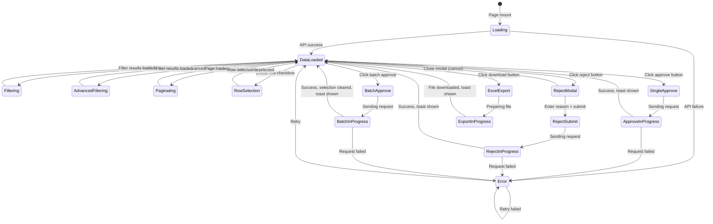

# 휴가 관리 화면 명세

> Document Version: 0.2  
> Last Updated: 2026-02-09  
> Screen ID: `hr-leave-management`  
> Route: `/leave-management`  
> Parent Layout: `HR Admin Layout`  
> Prototype File: `leave-management.html`

---

## 1. Screen Overview

### 1.1 Purpose

- **Primary Goal**: HR Administrators and Managers view, filter, and manage employee leave requests
- **Core Functions**:
  - View all leave records across the organization
  - Filter by date, leave type, department, status, and custom criteria
  - Approve or reject pending leave requests
  - Export leave data to Excel
  - Batch approve multiple requests

### 1.2 Access Control

| Role         | Access        | Scope             | Notes                                       |
| ------------ | ------------- | ----------------- | ------------------------------------------- |
| Employee     | None          | —                 | Cannot access; redirects to employee portal |
| Manager      | View + Action | Team members only | Can approve/reject team members' leave      |
| HR Admin     | Full          | All employees     | Full CRUD, batch actions, export            |
| System Admin | Full          | All               | Access to all data                          |

### 1.3 Entry Points

- **Primary**: Sidebar navigation menu → "휴가 관리" (Island/Plane icon)
- **From Dashboard**: Leave management card or quick action link
- **URL Direct**: `/leave-management` (requires HR Admin auth)
- **From Header Mode Selector**: Click "HR 관리자" tab to switch from employee portal

### 1.4 Exit Points

- **Sidebar**: Navigate to any other menu item (Dashboard, Attendance, Overtime, etc.)
- **Header**: Click "직원" to switch to employee portal
- **Modal Close**: Close rejection modal returns to main screen
- **Browser Back**: Navigate to previous page in browser history

---

## 2. Screen Layout

### 2.1 Full Layout Wireframe

```
┌─────────────────────────────────────────────────────────────────────────────────────────┐
│ Sidebar (w-64, fixed) │ HR 대시보드                                [직원 tab] [HR tab] ✓ │
├─────────────────────────────────────────────────────────────────────────────────────────┤
│                                                                                         │
│  휴가 관리                                                                              │
│  직원의 휴가 종류, 일정을 조회합니다                                                      │
│                                                                                         │
│  ┌─────────┬─────────┬─────────┬─────────┬─────────┐                                   │
│  │ 전체    │ 연차    │ 병가    │ 경조    │ 산전후  │                                   │
│  │  {n}건  │ {n}건   │ {n}건   │ {n}건   │ {n}건   │                                   │
│  └─────────┴─────────┴─────────┴─────────┴─────────┘                                   │
│                                                                                         │
│  ┌──────────────────────────────────────────────────────────────────────────────────┐  │
│  │ 날짜 범위                                                                        │  │
│  │ [YYYY-MM-DD] - [YYYY-MM-DD]   [오늘] [이번주] [이번달]                          │  │
│  │                                          [일괄 승인] [엑셀 다운로드]              │  │
│  └──────────────────────────────────────────────────────────────────────────────────┘  │
│                                                                                         │
│  ┌──────────────────────────────────────────────────────────────────────────────────┐  │
│  │ [필터 아이콘] 휴가 그룹: [연차] [병가]  [X 필터 추가]                             │  │
│  │ [+ 필터 추가]                                                                    │  │
│  └──────────────────────────────────────────────────────────────────────────────────┘  │
│                                                                                         │
│  ┌──────────────────────────────────────────────────────────────────────────────────┐  │
│  │ ☑ │ 사원 │ 직원   │ 조직   │ 휴가기간   │ 휴가그룹 │ 휴가유형 │ 유급 │ 차감 │ 사유 │ 상태 │ 관리 │
│  │────────────────────────────────────────────────────────────────────────────────  │  │
│  │ ☐ │ E001 │ 김민수 │ 개발팀 │ 2026.01.27 │ [연차]  │ 전일   │ 8h   │ 1일  │ 개인 │대기 │ ✓ ✗ │
│  │ ☐ │ E002 │ 이영지 │ 마케팅 │ 2026.01.28 │ [병가]  │ 전일   │ 8h   │ 1일  │ 감기 │승인 │ —   │
│  │ ☐ │ E003 │ 박철수 │ 영업팀 │ 2026.01.29 │ [경조]  │ 전일   │ 24h  │ 0일  │ 결혼 │대기 │ ✓ ✗ │
│  │   │ ... │ ... │ ... │ ...     │ ...     │ ...  │ ... │ ... │ ... │... │ ... │
│  │────────────────────────────────────────────────────────────────────────────────  │  │
│  │ 총 {total}건 중 {start}-{end}건                          [◀ Prev] 1 2 3 [Next ▶]   │  │
│  └──────────────────────────────────────────────────────────────────────────────────┘  │
│                                                                                         │
└─────────────────────────────────────────────────────────────────────────────────────────┘
```

### 2.2 Layout Zones

| Zone             | Position           | Description                                           | Sticky/Fixed    | Width                               |
| ---------------- | ------------------ | ----------------------------------------------------- | --------------- | ----------------------------------- |
| Sidebar          | Left               | Navigation menu, collapsible                          | Fixed           | 64px (collapsed) / 256px (expanded) |
| Header           | Top                | Title, breadcrumb, mode switcher                      | Fixed           | Full minus sidebar                  |
| Title            | Below header       | Screen title + description                            | No              | Full content area                   |
| Summary Cards    | Below title        | 5 stat cards (Total, Annual, Sick, Family, Maternity) | No              | 5 columns                           |
| Filter Panel     | Below cards        | Date range, quick select, action buttons              | No              | Full width                          |
| Advanced Filters | Below filter panel | Notion-style filter chips + Add filter button         | No              | Full width, horizontal scroll       |
| Data Table       | Main               | Paginated table with leave records                    | Vertical scroll | Full width                          |
| Pagination       | Bottom             | Item count, page navigation                           | Fixed bottom    | Full width                          |

---

## 3. Header Section

### 3.1 Title

- **Text**: "휴가 관리"
- **Subtitle**: "직원의 휴가 종류, 일정을 조회합니다"
- **Typography**:
  - Title: `text-2xl font-bold text-slate-800`
  - Subtitle: `text-slate-500`

### 3.2 Action Buttons

| #   | Button Label  | Icon       | Variant       | Position  | Condition                                        | Action                                                 |
| --- | ------------- | ---------- | ------------- | --------- | ------------------------------------------------ | ------------------------------------------------------ |
| 1   | 일괄 승인     | ✓ Check    | Success/Green | Right top | Visible when ≥1 row selected with PENDING status | Batch approve all selected PENDING records             |
| 2   | 엑셀 다운로드 | ↓ Download | Primary/Blue  | Right top | Always visible                                   | Export filtered data (or selected rows if any) to XLSX |

#### Button Specifications

**일괄 승인 (Batch Approve)**

- **Color**: `bg-green-600` hover `bg-green-700`
- **Text Color**: `text-white`
- **Disabled State**:
  - When no rows selected
  - When all selected rows have status ≠ PENDING
  - Display: `opacity-40 cursor-not-allowed`
- **Selection Display**: Shows count: `일괄 승인 (3)` when 3 rows selected
- **Confirmation**: Shows inline count, no dialog required before action
- **Success Toast**: `"{n}건이 승인되었습니다."` (green, 3s, top-right)
- **Error Toast**: `"승인할 대기 요청이 없습니다."` (red, 3s) if all selected are non-PENDING
- **Post-Action**: Clear selection, refresh table data

**엑셀 다운로드 (Excel Download)**

- **Color**: `bg-primary-600` hover `bg-primary-700`
- **Text Color**: `text-white`
- **Download Behavior**:
  - If rows selected: export only selected rows
  - If no selection: export all filtered rows
- **File Naming**: `휴가현황_{dateFrom}_{dateTo}.xlsx`
- **Columns**: `사원번호, 직원, 조직, 휴가 기간, 휴가 그룹, 휴가 유형, 유급 시간, 차감 일수, 사유`
- **Selection Display**: `엑셀 다운로드 (5건)` when 5 rows selected
- **Success Toast**: `"{n}건이 엑셀로 다운로드되었습니다."` (green, 3s)

---

## 4. Summary Cards

### 4.1 Card Layout

| #   | Label  | Badge Color | Icon | Value Source                      | Click Action               |
| --- | ------ | ----------- | ---- | --------------------------------- | -------------------------- |
| 1   | 전체   | slate-500   | —    | Sum of all filtered records       | (No action)                |
| 2   | 연차   | blue-600    | —    | Count where `leaveGroup='연차'`   | (No action - display only) |
| 3   | 병가   | amber-600   | —    | Count where `leaveGroup='병가'`   | (No action - display only) |
| 4   | 경조   | pink-600    | —    | Count where `leaveGroup='경조'`   | (No action - display only) |
| 5   | 산전후 | purple-600  | —    | Count where `leaveGroup='산전후'` | (No action - display only) |

### 4.2 Card Specification

```
┌─────────────────────────┐
│  전체                   │
│  {count}건              │  ← text-2xl font-bold, color varies
└─────────────────────────┘
   width: 1/5 - gap   height: auto
   padding: p-5       border-radius: rounded-2xl
   shadow: shadow-sm   border: border-slate-100 border
   bg: bg-white
```

**Detailed Styling**:

- **Width**: Responsive grid `grid-cols-5 gap-4`, each card takes 1/5 width
- **Height**: Auto, content-driven
- **Padding**: `p-5`
- **Border Radius**: `rounded-2xl`
- **Background**: `bg-white`
- **Border**: `border border-slate-100`
- **Shadow**: `shadow-sm`
- **Label Color**: `text-slate-500` (`text-sm`)
- **Count Color**: Color-coded per type (blue/amber/pink/purple/slate)
- **Count Font**: `text-2xl font-bold`
- **Unit**: `text-base font-normal text-slate-400` (e.g., "건")

### 4.3 Card Behavior

- **Clickable**: No, cards are display-only
- **Hover State**: No special interaction
- **Selection**: Not applicable
- **Count Updates**: Automatically recalculate when filters change
- **Empty State**: Shows "0건" if no records match filter

---

## 5. Filter System

### 5.1 Quick Filters

#### 5.1.1 Date Range Picker

| Property       | Value                                                                            |
| -------------- | -------------------------------------------------------------------------------- |
| Component type | Dual date input (start ~ end)                                                    |
| Display format | YYYY-MM-DD (HTML5 input type=date)                                               |
| API format     | YYYY-MM-DD ISO 8601                                                              |
| Default range  | Current month start to current month end (or last filtered date)                 |
| Min date       | No constraint                                                                    |
| Max date       | No constraint                                                                    |
| Placeholder    | Input fields show native date picker                                             |
| Styling        | `border border-slate-200 rounded-lg text-sm focus:ring-2 focus:ring-primary-500` |

**Behavior**:

- User changes start date → Apply filter immediately
- User changes end date → Apply filter immediately
- If start > end → Show validation error or swap automatically
- Affects table data in real-time

#### 5.1.2 Quick Select Buttons

| Button | Label   | Date Logic                                                    |
| ------ | ------- | ------------------------------------------------------------- |
| 1      | 오늘    | `startDate = today (2026-01-27)`, `endDate = today`           |
| 2      | 이번 주 | `startDate = Monday of week (2026-01-27)`, `endDate = Sunday` |
| 3      | 이번 달 | `startDate = 2026-01-01`, `endDate = 2026-01-31`              |

**Styling**:

- Container: `flex bg-slate-100 rounded-lg p-1`
- Button (inactive): `px-4 py-1.5 rounded-md text-sm font-medium text-slate-600`
- Button (active): `px-4 py-1.5 rounded-md text-sm font-medium bg-white text-slate-800 shadow-sm`
- Transition: All 0.3s ease

**Behavior**:

- Clicking button updates date range pickers
- Only one button is "active" at a time
- Active state shows white background + shadow
- Inactive buttons have slate-100 background
- Clicking active button again keeps it active (no toggle-off)

### 5.2 Advanced Filters (Notion-style)

#### 5.2.1 Filter Trigger

- **Button Label**: "+ 필터 추가"
- **Icon**: Plus icon (SVG `M12 4v16m8-8H4`)
- **Opens**: Dropdown menu with available filter options
- **Position**: Inline after existing filter chips

#### 5.2.2 Available Filter Types

| Filter Name | Filter Key   | Input Type     | Options/Values                       | Multi-select | Default | Backend Mapping      |
| ----------- | ------------ | -------------- | ------------------------------------ | ------------ | ------- | -------------------- |
| 휴가 그룹   | leaveGroup   | Badge selector | 연차, 병가, 경조, 무급, 산전후, 공가 | Yes          | All     | `leaveGroup` field   |
| 조직        | dept         | Text dropdown  | (dynamic from org chart)             | Yes          | None    | `dept` field         |
| 휴가 유형   | leaveType    | Text dropdown  | 연차, 반차, 병가, 경조사, 출산휴가   | Yes          | None    | `leaveType` field    |
| 유급시간    | paidHours    | Text dropdown  | 4h, 8h, 16h, 24h, 480h               | Yes          | None    | `paidHours` field    |
| 차감일수    | deductedDays | Text dropdown  | 0일, 0.5일, 1일, 2일                 | Yes          | None    | `deductedDays` field |
| 상태        | status       | Badge selector | 대기, 승인, 반려                     | Yes          | None    | `status` field       |

#### 5.2.3 Active Filter Chips

**Display Format**: `{Filter Label}: {Selected Value} [×]`

Example: `휴가 그룹: [연차] [병가], 상태: [대기]`

**Chip Styling**:

- Container: `inline-flex items-center gap-1.5 px-3 py-1.5 rounded-lg text-sm font-medium`
- With values: `bg-primary-50 border-primary-200 text-primary-700`
- Empty: `bg-white border-slate-200 text-slate-600`
- Close icon: `text-slate-400 hover:text-red-500`

**Behavior**:

- Click × to remove single filter value
- Click badge button to open/close dropdown
- Multiple values in same filter show first 2, then "+{n}" indicator
- Close icon only visible when filter has values

#### 5.2.4 Filter Combination Logic

- **Multiple different filters**: AND logic (e.g., `status='PENDING' AND leaveGroup='연차'`)
- **Multiple values within same filter**: OR logic (e.g., `leaveGroup IN ['연차', '병가']`)
- **Filters apply to**:
  - Table data rows
  - Summary card counts
  - Excel export selection

#### 5.2.5 Filter Persistence

- **Page Refresh**: Filters lost (stored in React state only)
- **URL Parameters**: Could be implemented as query params (e.g., `?leaveGroup=annual&status=pending`)
- **Session Storage**: Not currently implemented; future enhancement

---

## 6. Data Table

### 6.1 Column Definitions

| #   | Column Key   | Header Label | Width | Min Width | Sortable | Resizable | Align  | Sticky |
| --- | ------------ | ------------ | ----- | --------- | -------- | --------- | ------ | ------ |
| 1   | select       | (checkbox)   | 40px  | 40px      | No       | No        | Center | No     |
| 2   | empNo        | 사원번호     | 100px | 80px      | No       | No        | Left   | No     |
| 3   | name         | 직원         | 100px | 80px      | No       | No        | Left   | No     |
| 4   | dept         | 조직         | 100px | 80px      | No       | No        | Left   | No     |
| 5   | leavePeriod  | 휴가 기간    | 150px | 120px     | No       | No        | Left   | No     |
| 6   | leaveGroup   | 휴가 그룹    | 100px | 80px      | No       | No        | Left   | No     |
| 7   | leaveType    | 휴가 유형    | 100px | 80px      | No       | No        | Left   | No     |
| 8   | paidHours    | 유급 시간    | 80px  | 60px      | No       | No        | Center | No     |
| 9   | deductedDays | 차감 일수    | 80px  | 60px      | No       | No        | Center | No     |
| 10  | reason       | 사유         | 150px | 100px     | No       | No        | Left   | No     |
| 11  | status       | 상태         | 80px  | 70px      | No       | No        | Center | No     |
| 12  | actions      | 관리         | 80px  | 70px      | No       | No        | Center | No     |

### 6.2 Column Detail — Cell Rendering

#### Column 1: Checkbox (select)

- **Data type**: boolean
- **Component**: HTML checkbox
- **Styling**: `w-4 h-4 text-primary-600 rounded`
- **Header Checkbox**: Selects/deselects all rows on current page
- **Behavior**: Click to toggle row selection

#### Column 2: 사원번호 (empNo)

- **Data type**: string
- **Display format**: Plain text (e.g., "E001")
- **Component**: Inline text
- **Styling**: `text-sm text-slate-600`
- **Truncation**: No truncation
- **Click behavior**: None

#### Column 3: 직원 (name)

- **Data type**: string
- **Display format**: Employee name (e.g., "김민수")
- **Component**: Text with medium weight
- **Styling**: `text-sm font-medium text-slate-800`
- **Truncation**: Max 20 chars, ellipsis + tooltip on hover
- **Click behavior**: None (future: could navigate to employee detail)

#### Column 4: 조직 (dept)

- **Data type**: string
- **Display format**: Department name (e.g., "개발팀")
- **Component**: Inline text
- **Styling**: `text-sm text-slate-600`
- **Truncation**: No truncation
- **Click behavior**: None

#### Column 5: 휴가 기간 (leavePeriod)

- **Data type**: string (formatted period)
- **Display format**:
  - Single day: `YYYY.MM.DD` (e.g., "2026.01.27")
  - Multiple days: `YYYY.MM.DD ~ YYYY.MM.DD` (e.g., "2026.01.27 ~ 2026.01.30")
  - Half day: `YYYY.MM.DD (오전)` or `YYYY.MM.DD (오후)`
- **Component**: Inline text
- **Styling**: `text-sm text-slate-600`
- **Truncation**: No truncation
- **Click behavior**: None

#### Column 6: 휴가 그룹 (leaveGroup)

- **Data type**: enum (LeaveGroup)
- **Display format**: Badge with color
- **Component**: Badge/span
- **Conditional rendering**:
  | Value | Label | Badge BG | Badge Text | Font Weight |
  |-------|-------|----------|-----------|-------------|
  | annual | 연차 | blue-100 | blue-900 | 600 |
  | sick | 병가 | amber-100 | amber-900 | 600 |
  | family | 경조 | rose-100 | rose-900 | 600 |
  | maternity | 산전후 | purple-100 | purple-900 | 600 |
  | unpaid | 무급 | slate-100 | slate-600 | 600 |
  | official | 공가 | green-100 | green-900 | 600 |

- **Styling**: `leave-badge {category-specific-class}`
- **Click behavior**: None

#### Column 7: 휴가 유형 (leaveType)

- **Data type**: enum
- **Display format**: Badge text (e.g., "전일", "오전반차", "오후반차")
- **Component**: Inline text
- **Styling**: `text-sm text-slate-600`
- **Truncation**: No truncation
- **Click behavior**: None

#### Column 8: 유급 시간 (paidHours)

- **Data type**: string (with unit)
- **Display format**: `{number}h` (e.g., "8h", "24h", "480h")
- **Component**: Inline text
- **Styling**: `text-sm text-slate-600`
- **Alignment**: Center
- **Click behavior**: None

#### Column 9: 차감 일수 (deductedDays)

- **Data type**: number
- **Display format**: `{value}일` (e.g., "1일", "0.5일", "2일")
- **Component**: Text with medium weight
- **Styling**: `text-sm font-medium text-slate-800`
- **Alignment**: Center
- **Click behavior**: None

#### Column 10: 사유 (reason)

- **Data type**: string
- **Display format**: Free text (e.g., "개인 사유", "병원 진료")
- **Component**: Text with truncation
- **Styling**: `text-sm text-slate-600`
- **Truncation**: Max 30 chars, ellipsis + tooltip on hover
- **Click behavior**: None

#### Column 11: 상태 (status)

- **Data type**: enum (LeaveStatus)
- **Display format**: Badge with color
- **Component**: Badge/span
- **Conditional rendering**:
  | Value | Label | Badge BG | Badge Text | Font Weight |
  |-------|-------|----------|-----------|-------------|
  | pending | 대기 | amber-100 | amber-900 | 600 |
  | approved | 승인 | green-100 | green-900 | 600 |
  | rejected | 반려 | red-100 | red-900 | 600 |

- **Styling**: `status-badge {status-specific-class}`
- **Click behavior**: None

#### Column 12: 관리 (actions)

- **Data type**: component
- **Component**: Conditional button group
- **If `status === 'pending'`**:
  - Two icon buttons side-by-side:
    | Icon | Tooltip | Variant | Action | Color |
    |------|---------|---------|--------|-------|
    | ✓ | 승인 | Icon Button | Approve this record | Green (bg-green-100, text-green-700) |
    | ✗ | 반려 | Icon Button | Open reject modal | Red (bg-red-100, text-red-700) |
  - Styling: `p-2 rounded-lg hover:bg-{color}-200 transition-colors`
  - Size: `w-10 h-10` (implied from `p-2`)

- **If `status !== 'pending'`**:
  - Display text: "처리완료"
  - Styling: `text-xs text-slate-400`
  - No interactive elements

---

### 6.3 Table Behaviors

#### 6.3.1 Row Selection

- **Header checkbox**:
  - Check: Select all rows on current page
  - Uncheck: Deselect all rows on current page
  - Does NOT select across all pages
- **Indeterminate state**:
  - When some (but not all) rows on page are selected
  - Header checkbox shows mixed state visually
- **Selection count display**:
  - Shown in pagination info: `({selectedCount}건 선택됨)`
  - Updated dynamically as selections change
- **Selection restrictions**:
  - Can select rows with any status (not just PENDING)
  - Batch approve only processes PENDING rows
- **Selection persistence**:
  - Clears when user navigates pages
  - Clears when filters change
  - Clears after successful batch action

#### 6.3.2 Sorting

- **Default sort**: No default sort applied; rows displayed in data order
- **Multi-column sort**: Not supported
- **Sortable columns**: None (all columns non-sortable in current design)
- **Sort indicator**: N/A
- **Client-side or server-side**: N/A

#### 6.3.3 Row Click

- **Does clicking a row do anything**: No
- **Hovering**: Shows `hover:bg-slate-50` background on row
- **Selection**: Only checkbox click selects; clicking row content does not

#### 6.3.4 Empty State

```
┌───────────────────────────┐
│                           │
│                           │
│   검색 결과가 없습니다.   │
│                           │
│                           │
└───────────────────────────┘
```

- **Message when no data**: "검색 결과가 없습니다."
- **Message when filters return no results**: Same message
- **Styling**: Centered text, `text-center text-slate-400`, takes full table height
- **Column span**: Spans all 12 columns

#### 6.3.5 Loading State

- **Not shown in current prototype**; loads synchronously
- **Future enhancement**: Could add skeleton loaders during data fetch
- **Placeholder**: 10-15 shimmer rows

#### 6.3.6 Error State

- **Not shown in current prototype**; no error handling visible
- **Future enhancement**: Show error message with retry button
- **Message format**: "{error message}" + "다시 시도" button

---

## 7. Pagination

### 7.1 Specification

| Property                 | Value                                                 |
| ------------------------ | ----------------------------------------------------- |
| Items per page           | 15 (default)                                          |
| Page size options        | [15, 30, 50] (not in current UI)                      |
| Info text format         | `총 {total}건 중 {start}-{end}건`                     |
| Selection info           | `({selectedCount}건 선택됨)` — shown when ≥1 selected |
| Max visible page numbers | 5 (display last 5 pages)                              |
| Show first/last buttons  | No                                                    |
| Show prev/next buttons   | Yes                                                   |
| Disabled states          | Prev disabled on page 1, Next disabled on last page   |

**Styling**:

- Container: `flex items-center justify-between px-6 py-4 border-t border-slate-100`
- Info text: `text-sm text-slate-600`
- Selection info: `text-primary-600 font-medium`
- Button (active): `bg-primary-600 text-white`
- Button (inactive): `border border-slate-200 text-slate-600 hover:bg-slate-50`
- Button (disabled): `opacity-40 cursor-not-allowed`
- Prev/Next: `px-3 py-1 rounded-lg text-sm`
- Page number buttons: `px-3 py-1 rounded-lg text-sm transition-colors`

### 7.2 Edge Cases

- **Total items = 0**:
  - Pagination shows "총 0건 중 0-0건"
  - Prev/Next buttons disabled
  - No page number buttons shown
- **Total items ≤ page size (15)**:
  - Pagination still shown
  - Only page 1 button displayed
  - Prev/Next both disabled
- **Page exceeds available**:
  - Not applicable; page is validated against `totalPages`
  - Clicking outside valid range does nothing

---

## 8. Modals & Dialogs

### 8.1 Rejection Modal ("반려 사유 입력")

#### Wireframe

```
┌─────────────────────────────────────────┐
│  반려 사유 입력                       [×]│
├─────────────────────────────────────────┤
│                                         │
│  반려 사유                               │
│  ┌─────────────────────────────────┐  │
│  │                                 │  │
│  │ 반려 사유를 입력해주세요         │  │
│  │                                 │  │
│  │                                 │  │
│  └─────────────────────────────────┘  │
│                                         │
│              [취소] [반려하기]           │
│                                         │
└─────────────────────────────────────────┘
```

#### Specification

| Property  | Value                                         |
| --------- | --------------------------------------------- |
| Trigger   | Click reject button (✗) in action column      |
| Title     | "반려 사유 입력"                              |
| Width     | `w-full max-w-md` (max 448px)                 |
| Closable  | Click × button, click overlay (outside modal) |
| Overlay   | Yes, `bg-black/50` (50% opacity)              |
| Position  | Centered on screen                            |
| Animation | Slide up + fade in                            |

#### Form Fields

| #   | Field  | Label     | Type     | Required | Placeholder                | Validation | Max Length |
| --- | ------ | --------- | -------- | -------- | -------------------------- | ---------- | ---------- |
| 1   | reason | 반려 사유 | Textarea | Yes      | "반려 사유를 입력해주세요" | Min 1 char | 500        |

**Textarea Styling**:

- Rows: 4
- Class: `w-full px-3 py-2 border border-slate-200 rounded-lg text-sm focus:outline-none focus:ring-2 focus:ring-primary-500`
- Placeholder: "반려 사유를 입력해주세요"

#### Actions

| Button  | Label    | Variant   | Color | Action                                    | Disabled When                | Loading Text | Success Toast            | Error Toast            |
| ------- | -------- | --------- | ----- | ----------------------------------------- | ---------------------------- | ------------ | ------------------------ | ---------------------- |
| Cancel  | 취소     | Secondary | Slate | Close modal without action                | Never                        | —            | —                        | —                      |
| Confirm | 반려하기 | Danger    | Red   | Submit rejection, mark status as REJECTED | `reason.trim().length === 0` | N/A          | "요청이 반려되었습니다." | "처리에 실패했습니다." |

**Button Styling**:

- Container: `flex gap-3` (flex-1 for each button)
- Cancel: `py-2 bg-slate-100 text-slate-700 rounded-lg font-medium hover:bg-slate-200`
- Confirm: `py-2 bg-red-600 text-white rounded-lg font-medium hover:bg-red-700`

**Modal Behavior**:

- Trigger: Click ✗ button in actions column for row with status='pending'
- On open: Focus on textarea automatically
- On close (Cancel): Dismiss modal, no data change
- On close (X button): Dismiss modal, no data change
- On close (Overlay click): Dismiss modal, no data change
- On submit:
  - Validate reason field (must have text)
  - If invalid: Show error toast "반려 사유를 입력해주세요."
  - If valid: Update row status to REJECTED, show success toast, close modal

---

## 9. Toast & Notification Messages

| #   | Trigger                            | Type    | Message                              | Duration | Position  | Dismissible |
| --- | ---------------------------------- | ------- | ------------------------------------ | -------- | --------- | ----------- |
| 1   | Approve single success             | Success | "요청이 승인되었습니다."             | 3s       | Top-right | Yes         |
| 2   | Batch approve success              | Success | "{n}건이 승인되었습니다."            | 3s       | Top-right | Yes         |
| 3   | Batch approve error (no pending)   | Error   | "승인할 대기 요청이 없습니다."       | 3s       | Top-right | Yes         |
| 4   | Reject submit error (empty reason) | Error   | "반려 사유를 입력해주세요."          | 3s       | Top-right | Yes         |
| 5   | Reject confirm success             | Success | "요청이 반려되었습니다."             | 3s       | Top-right | Yes         |
| 6   | Excel export success               | Success | "{n}건이 엑셀로 다운로드되었습니다." | 3s       | Top-right | Yes         |

**Toast Styling**:

- Container: `fixed bottom-4 right-4 z-50 px-4 py-3 rounded-xl shadow-lg flex items-center gap-3`
- Success: `bg-green-500 text-white`
- Error: `bg-red-500 text-white`
- Info: `bg-slate-800 text-white`
- Icon: SVG checkmark (success) or X (error)
- Animation: Slide in from right, fade in

---

## 10. Data Model (Screen-level)

### 10.1 Primary Entity

```typescript
interface LeaveRecord {
  id: number; // Unique identifier (1, 2, 3, ...)
  empNo: string; // Employee number (e.g., "E001")
  name: string; // Employee name (e.g., "김민수")
  dept: string; // Department name (e.g., "개발팀")
  deptKey: string; // Department key for filtering (e.g., "dev")
  startDate: string; // ISO 8601 date "YYYY-MM-DD"
  endDate: string; // ISO 8601 date "YYYY-MM-DD"
  leavePeriod: string; // Formatted period display (e.g., "2026-01-27 ~ 2026-01-30")
  leaveGroup: string; // 휴가 그룹 Korean name
  leaveGroupKey: string; // Internal key (e.g., "annual", "sick")
  leaveType: string; // 휴가 유형 (e.g., "전일", "오전반차")
  paidHours: string; // Paid hours with unit (e.g., "8h")
  deductedDays: number; // Number of days deducted
  reason: string; // Reason for leave
  status: LeaveStatus; // Current status
  rejectionReason?: string; // Reason for rejection (optional, if rejected)
}
```

### 10.2 Enums

```typescript
enum LeaveStatus {
  PENDING = "pending", // 대기
  APPROVED = "approved", // 승인
  REJECTED = "rejected", // 반려
}

enum LeaveGroup {
  ANNUAL = "annual", // 연차
  SICK = "sick", // 병가
  FAMILY = "family", // 경조
  MATERNITY = "maternity", // 산전후
  UNPAID = "unpaid", // 무급
  OFFICIAL = "official", // 공가
}
```

### 10.3 Summary Data

```typescript
interface LeaveManagementSummary {
  total: number; // Total filtered records
  annual: number; // Count of 연차
  sick: number; // Count of 병가
  family: number; // Count of 경조
  maternity: number; // Count of 산전후
}
```

### 10.4 Filter/Query Parameters

```typescript
interface LeaveManagementQuery {
  dateFrom?: string; // Start date (YYYY-MM-DD)
  dateTo?: string; // End date (YYYY-MM-DD)
  leaveGroup?: string[]; // Multiple leave group keys
  dept?: string[]; // Multiple department keys
  leaveType?: string[]; // Multiple leave types
  paidHours?: string[]; // Multiple paid hour values
  deductedDays?: number[]; // Multiple deducted days
  status?: LeaveStatus[]; // Multiple statuses
  page: number; // Current page (1-indexed)
  pageSize: number; // Items per page (default 15)
  searchQuery?: string; // Text search (name, empNo, dept)
}
```

---

## 11. API Requirements

### 11.1 API Calls

| #   | Method | Endpoint                       | Purpose          | Trigger                               | Request Params                       | Response Shape                                                                   |
| --- | ------ | ------------------------------ | ---------------- | ------------------------------------- | ------------------------------------ | -------------------------------------------------------------------------------- |
| 1   | GET    | `/api/v1/leaves`               | Fetch leave list | Page load, filter change, page change | LeaveManagementQuery                 | `{ data: LeaveRecord[], meta: PaginationMeta, summary: LeaveManagementSummary }` |
| 2   | PATCH  | `/api/v1/leaves/{id}/approve`  | Approve single   | Click approve icon                    | `{ id }`                             | `{ success: boolean, record: LeaveRecord }`                                      |
| 3   | PATCH  | `/api/v1/leaves/{id}/reject`   | Reject single    | Submit reject modal                   | `{ id, reason: string }`             | `{ success: boolean, record: LeaveRecord }`                                      |
| 4   | PATCH  | `/api/v1/leaves/batch-approve` | Batch approve    | Click batch approve                   | `{ ids: number[] }`                  | `{ success: boolean, processed: number, errors?: string[] }`                     |
| 5   | GET    | `/api/v1/leaves/export`        | Excel download   | Click download                        | LeaveManagementQuery + `format=xlsx` | Blob (xlsx file)                                                                 |

### 11.2 Response Shapes

```typescript
// GET /api/v1/leaves
interface GetLeavesResponse {
  data: LeaveRecord[];
  meta: {
    total: number;
    page: number;
    pageSize: number;
    totalPages: number;
  };
  summary: LeaveManagementSummary;
}

// PATCH /api/v1/leaves/{id}/approve
interface ApproveResponse {
  success: boolean;
  record: LeaveRecord;
  message?: string;
}

// PATCH /api/v1/leaves/{id}/reject
interface RejectResponse {
  success: boolean;
  record: LeaveRecord;
  message?: string;
}

// PATCH /api/v1/leaves/batch-approve
interface BatchApproveResponse {
  success: boolean;
  processed: number;
  failed: number;
  errors?: string[];
}

// GET /api/v1/leaves/export
// Returns binary stream (xlsx file)
```

### 11.3 Realtime Requirements

- **WebSocket**: Not required for current prototype
- **Polling**: Not required; page loads data once on mount
- **Future enhancement**: Could implement WebSocket for live updates when other HR admins approve/reject records

---

## 12. Responsive Behavior

### 12.1 Breakpoints

| Breakpoint | Width      | Layout Changes                                                 |
| ---------- | ---------- | -------------------------------------------------------------- |
| Desktop    | ≥1280px    | Full layout as wireframed                                      |
| Tablet     | 768-1279px | Summary cards stack 3+2, table horizontal scroll               |
| Mobile     | <768px     | Summary cards stack vertically (1 col), table → card list view |

### 12.2 Component-level Responsive Rules

**Summary Cards**:

- Desktop: `grid-cols-5` (5 columns)
- Tablet: `grid-cols-2` with last card wrapping (3 on first row, 2 on second)
- Mobile: `grid-cols-1` (1 column, stacked)

**Filter Bar**:

- Desktop: Horizontal layout
- Tablet: Wrap to 2 rows if needed
- Mobile: Vertical stack, full width inputs

**Action Buttons**:

- Desktop: Both buttons visible side-by-side
- Tablet: Both buttons visible, may wrap
- Mobile: Stack vertically or collapse into "⋮" menu

**Data Table**:

- Desktop: Full table with all columns visible
- Tablet: Table with horizontal scroll
- Mobile: Transform to card view:
  ```
  ┌─────────────────┐
  │ 직원: 김민수      │
  │ 사원번호: E001   │
  │ 조직: 개발팀     │
  │ 휴가기간: 2026.01.27 │
  │ 상태: 대기       │
  │ [✓] [✗]         │
  └─────────────────┘
  ```

**Pagination**:

- Desktop: Full layout with all elements
- Tablet: Simplified, hidden page numbers if needed
- Mobile: Prev/Next buttons only, info text on separate line

---

## 13. Keyboard & Accessibility

| Action           | Shortcut | Notes                                            |
| ---------------- | -------- | ------------------------------------------------ |
| Select all       | Ctrl+A   | When table focused                               |
| Navigate rows    | ↑ ↓      | Keyboard row navigation (future enhancement)     |
| Navigate buttons | Tab      | Standard tab order                               |
| Open filter      | —        | Tab-accessible, focus on button triggers display |
| Submit modal     | Enter    | When modal open and focused on submit button     |
| Close modal      | ESC      | Any modal/dialog                                 |
| Approve row      | Ctrl+Y   | (Future enhancement)                             |
| Reject row       | Ctrl+N   | (Future enhancement)                             |

**Accessibility Requirements**:

- ✅ ARIA labels on all interactive elements
- ✅ Focus management in modals (focus trap)
- ✅ Screen reader announcements for async actions
- ✅ Color contrast compliance (WCAG AA) for all badge colors
- ✅ Semantic HTML for table structure
- ✅ Alternative text for icons (title attribute)
- ⏳ (Future) High contrast mode support

---

## 14. State Diagram



---

## 15. Edge Cases & Special Behaviors

| #   | Scenario                                                          | Expected Behavior                                                            |
| --- | ----------------------------------------------------------------- | ---------------------------------------------------------------------------- |
| 1   | User approves already-approved record (race condition)            | Show error toast: "이미 처리된 건입니다."                                    |
| 2   | User selects mix of PENDING and non-PENDING rows                  | Batch approve button processes only PENDING ones                             |
| 3   | Session expires during action                                     | Redirect to login with return URL `/leave-management`                        |
| 4   | Network timeout on approve                                        | Show error toast + auto-retry after 3s or manual retry button                |
| 5   | Very long employee name                                           | Truncate with ellipsis, full text on hover tooltip                           |
| 6   | Very long reason text                                             | Truncate with ellipsis in table, show full in rejection modal                |
| 7   | Filter returns 0 results                                          | Show "검색 결과가 없습니다." in table, summary shows 0 for all cards         |
| 8   | User filters then pages to page 2, filter changes                 | Reset to page 1 with new filter results                                      |
| 9   | User selects rows, then changes filter                            | Keep selected rows (even if no longer visible) until page refresh or clear   |
| 10  | Excel export with ≥10,000 records                                 | May timeout; could implement chunked export or show progress                 |
| 11  | User clicks approve while another admin is processing same record | Optimistic UI update, then sync on response; show conflict error if needed   |
| 12  | Mobile user on small screen with long table                       | Show horizontal scroll indicator, simplified view or card mode               |
| 13  | User rejects with no reason text                                  | Show validation error: "반려 사유를 입력해주세요." (red outline on textarea) |
| 14  | Multiple filters with conflicting logic                           | Apply all filters with AND logic; show empty result if no matches            |
| 15  | Pagination page number > total pages                              | Don't allow navigation; disable Next button; redirect to last page           |

---

## 16. Related Screens

| Screen                                             | Relationship               | Navigation                       | Notes                                   |
| -------------------------------------------------- | -------------------------- | -------------------------------- | --------------------------------------- |
| [emp-leave-management.md](emp-leave-management.md) | Employee view of leave     | "직원" tab in header             | Shows only employee's own leave records |
| [leave-request.md](leave-request.md)               | Create/edit leave requests | Button or modal from this screen | New leave request form                  |
| [hr-dashboard.md](hr-dashboard.md)                 | Summary dashboard          | Sidebar → 대시보드               | Overview with leave stats               |
| [reports.md](reports.md)                           | Reports & analytics        | Sidebar → 리포트                 | Detailed leave analytics and trends     |

---

## Implementation Checklist

- [ ] Layout: Sidebar + Header + Content area
- [ ] Summary cards with color-coded categories
- [ ] Date range picker with quick select buttons
- [ ] Notion-style advanced filters with chips
- [ ] Data table with 12 columns and row selection
- [ ] Pagination with page navigation
- [ ] Action buttons (Approve, Reject, Export)
- [ ] Rejection modal with form validation
- [ ] Toast notifications for all actions
- [ ] Filter persistence and state management
- [ ] Excel export functionality
- [ ] Batch approve logic (pending only)
- [ ] Mobile responsive design
- [ ] Accessibility (ARIA, keyboard navigation)
- [ ] Error handling and edge cases
- [ ] Loading states (future)
- [ ] API integration (future)

---

**Document Version**: 0.2  
**Last Updated**: 2026-02-09  
**Status**: Specification Complete - Ready for Frontend Development  
**Frontend Developer Notes**: All UI elements and behaviors are defined. Ready for implementation with React components and Tailwind CSS styling. Sample data generation is implemented in prototype; replace with API calls in production.
